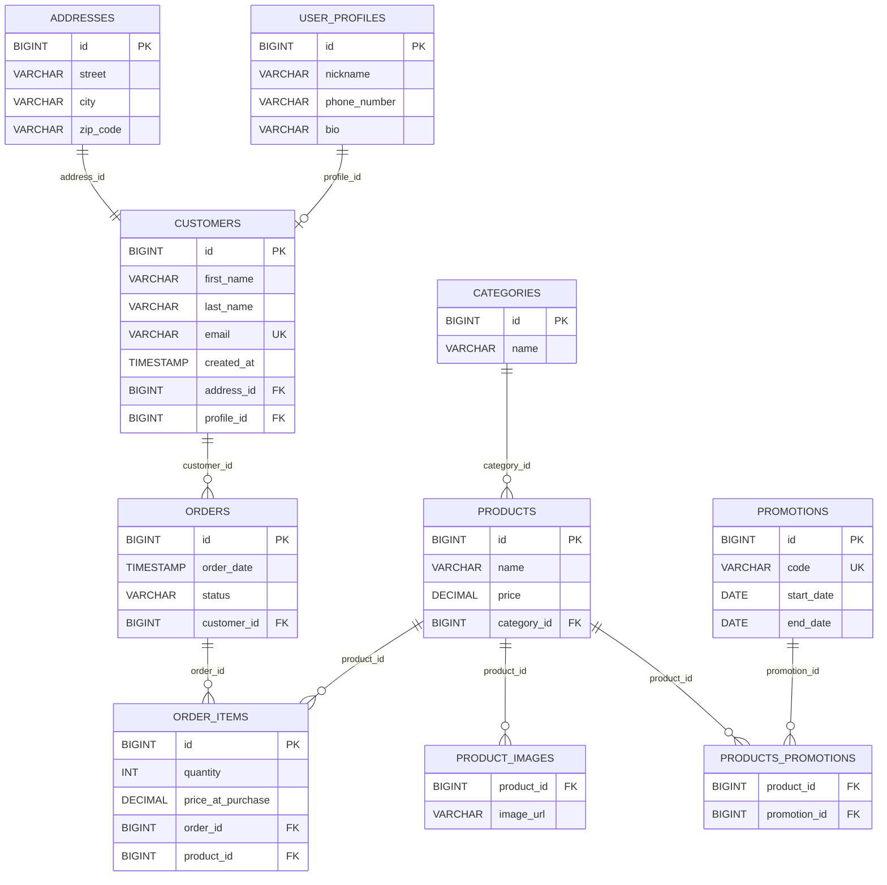



# Lexicon WS eCommerce JPA

Spring Boot e-commerce platform built with JPA, focusing on One-to-One relationships.

## Tech Stack

- Java 17
- Spring Boot 4.1.1
- Spring Data JPA
- H2 (runtime/test) + MySQL (production/development)
- Lombok
- Maven

## Entity-Relationship Diagram (Mermaid)

Full database schema from **Part 1** (One-to-One) and **Part 2** (catalog, orders, many-to-many).

## Project Checklist

### Setup

- [x] Maven `pom.xml` configured with required dependencies
- [x] Git repository initialized
- [x] Workshop files committed
- [x] Application starts without errors
- [x] Pushed to GitHub
- [x] Share with the teacher.
- [x] added resources/application.properties
- [x] added profile properties (application-dev.properties)

### Entities (Part 1)

- [x] Address (table `addresses`, unidirectional, standalone)
- [x] UserProfile (table `user_profiles`, inverse side with `mappedBy`)
- [x] Customer (table `customers`, owner side)
  - [x] Unidirectional One-to-One with Address (`address_id`)
  - [x] Bidirectional One-to-One with UserProfile (`profile_id`, optional)
  - [x] Cascading and orphan removal configured (`CascadeType.ALL` + `orphanRemoval` on Address and profile)

### Repositories (Part 1)

> Backed by a DAO layer (`...DAO` interfaces + `...DAOImpl`) instead of the Spring Data `JpaRepository` interfaces specified in the workshop.

- [x] CustomerDAO / CostumerDAOImpl - fully implemented
  - [x] Find by email (`findByEmail`)
  - [x] Find by last name, case-insensitive (`findByLastName`)
  - [x] Find by city (`findByCity`)
  - [x] Find by full name / first name (`findByFullName`, `findByFirstName`)
  - [x] CRUD: save, findAll, update, delete, deleteById, deleteByFullName
  - [x] Existence checks: existByFirstName / existByLastName / existByFullName / existByEmail
  - [x] Bulk updates: updateFirstNameByEmail / updateLastNameByEmail / updateFullNameByEmail
  - [x] Optional Spring Data queries (implemented):
    - [x] `findByEmailContaining` - email contains keyword
    - [x] `findByCreatedAfter` - created after one date
    - [x] `findByCreatedBetween` - created between two dates
    - [x] `countByCity` - count of customers in a city
<<<<<<< Updated upstream
- [x] UserProfileDAO / UserProfileDAOImpl - interface + skeleton, query methods still TODO stubs
  - [ ] Find by nickname (`findByNickName`)
  - [ ] Find by partial phone number (`findByPhoneNumberContaining`)
  - [ ] Optional: bio not null, nickname prefix, count by phone prefix
- [x] AddressDAO / AddressDAOImpl - interface + skeleton, query methods still TODO stubs
  - [ ] Find by zip code (`findByZipCode`)
  - [ ] Optional: find by city, street name, zip code prefix, count by zip (customers)
=======
- [x] UserProfileDAO / UserProfileDAOImpl - fully implemented
  - [x] Find by nickname, case-insensitive (`findByNickName`)
  - [x] Find by partial phone number (`findByPhoneNumberContaining`)
  - [x] Find by bio not null (`findByBioIsNotNull`)
  - [x] Optional: nickname prefix (`findByNickNameStartingWith`), count by phone prefix (`countByPhoneNumberStartingWith`)
  - [x] Existence checks: existByNickName / existByPhoneNumber
  - [x] CRUD: findById, save, findAll, update, delete, deleteById
- [x] AddressDAO / AddressDAOImpl - fully implemented
  - [x] Find by zip code (`findByZipCode`)
  - [x] Optional: find by city, street name, zip code prefix, count by zip (customers)
  - [x] Existence check: existByZipCode
  - [x] CRUD: findById, save, findAll, update, delete, deleteById
>>>>>>> Stashed changes

### Optional Task: CustomerRepository / CustomerDAO

From `SpringBoot-DataJPA-Workshop-Part1.md` (Repository Layer, section 1). The optional queries are five
separate single-purpose methods, each asking one question. Do **not** overload `findByEmail` with date
parameters - an email lookup and a date filter are different questions.

1. **Email contains a keyword**: a method like `findByEmailContaining(String keyword)`. The concept is any
   email that has the keyword somewhere in the middle. In JPQL this is `LIKE` with `%` wildcards around the
   bound value. The impl currently puts the `%` into the JPQL via `CONCAT`:
   `c.email LIKE LOWER(CONCAT('%', :keyword, '%'))`. You can also build the `%` into the value you pass
   (`"%" + keyword + "%"`) and keep the JPQL as a plain `LIKE :keyword`.
2. **Created after a date**: takes **one** `Instant`, e.g. `findByCreatedAfter(Instant date)`. Concept:
   `c.createdAt > :date` (use `>=` if you want to include customers created at that exact moment).
3. **Created between two dates**: takes **two** `Instant`s (start and end), e.g.
   `findByCreatedBetween(Instant start, Instant end)`. Concept: `c.createdAt BETWEEN :start AND :end`
   (inclusive of both bounds).
4. **Count customers in a city**: returns a number, not a list. Return type `long`/`Long`, e.g.
   `countByCity(String city)`. Concept: `SELECT COUNT(c) FROM Customer c WHERE c.address.city = :city` and
   read the single result with `.getSingleResult()`.
5. **Exists by email**: returns `boolean`, e.g. `existByEmail(String email)` - already present in the DAO.

Reminders when writing these:

- JPQL uses **entity field names** (`c.createdAt`, `c.address.city`), not database column names
  (`created_at`, `city`).
- The placeholder name in the JPQL string and the string inside `.setParameter("...", ...)` must match
  exactly, or JPA throws `IllegalArgumentException` at runtime.
- `Instant` lives in `java.time`, so the interface needs `import java.time.Instant;`.
- Each method needs both a declaration in `CustomerDAO` and an implementation in `CostumerDAOImpl`.

### Verification & Delivery (Part 1)

- [x] Feature branch created (`feature/jpa-part1`) - currently all work is on `main`
- [x] Application runs and schema generated correctly
- [x] Descriptive commits for each major step
- [x] Branch pushed to GitHub with link provided

### Part 2: Catalog & Orders

- [ ] Feature branch created (`feature/jpa-part2`)
- [ ] Entities & enums (Category, Product, Promotion, Order, OrderItem, OrderStatus)
- [ ] Relationships (Many-to-One, One-to-Many, Many-to-Many) with ownership and cascading
- [ ] Repositories (Category, Product, Order, Promotion) incl. N+1-safe order-status query
- [ ] Extra task: data seeding
- [ ] Application runs, schema generated, data seeded
- [ ] Descriptive commits for each major step
- [ ] Branch pushed to GitHub with link provided

## Workshop

See `SpringBoot-DataJPA-Workshop-Part1.md` for the full assignment details.
See `SpringBoot-DataJPA-Workshop-Part2.md` for Part 2 (catalog management, transactions, many-to-many).

## Notes

See `Spring-Data-JPA-Annotation-Guide.md` for the annotations guide.
