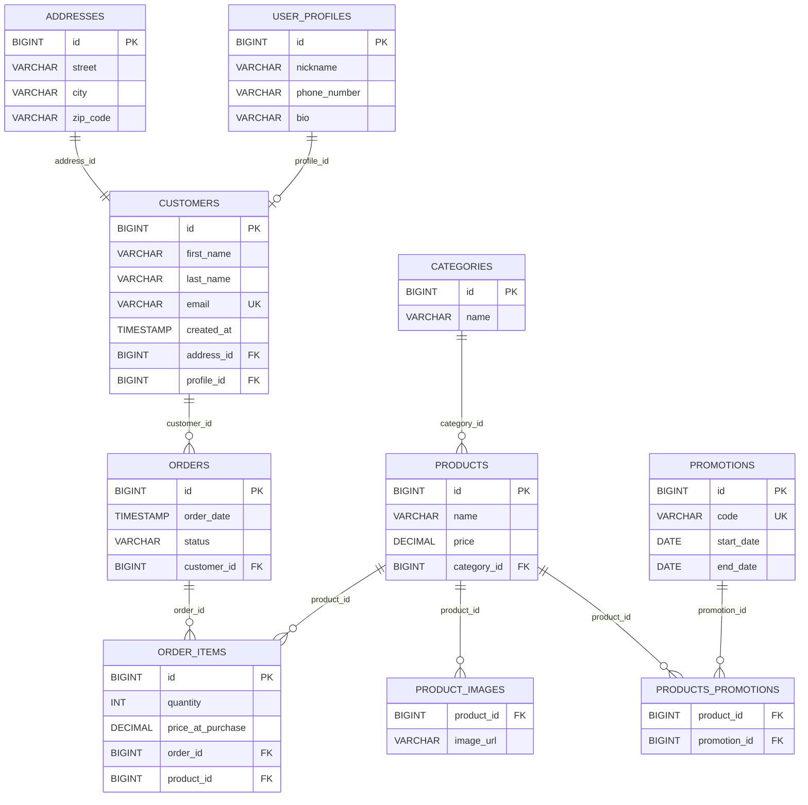



# Lexicon WS eCommerce JPA

Spring Boot e-commerce platform built with JPA. **Part 1** covers One-to-One relationships
(Customer / Address / UserProfile); **Part 2** adds the catalog and ordering system (Category, Product,
Promotion, Order, OrderItem) with One-to-Many and Many-to-Many relationships.

## Tech Stack

- Java 17
- Spring Boot 4.1.1
- Spring Data JPA
- H2 (runtime/test) + MySQL (production/development)
- Lombok
- Maven

## Entity-Relationship Diagram (Mermaid)

Full database schema from **Part 1** (One-to-One) and **Part 2** (catalog, orders, many-to-many).

## Project Checklist

### Setup

- [x] Maven `pom.xml` configured with required dependencies
- [x] Git repository initialized
- [x] Workshop files committed
- [x] Application starts without errors
- [x] Pushed to GitHub
- [x] Share with the teacher.
- [x] added resources/application.properties
- [x] added profile properties (application-dev.properties)

### Entities (Part 1)

- [x] Address (table `addresses`, unidirectional, standalone)
- [x] UserProfile (table `user_profiles`, inverse side with `mappedBy`)
- [x] Customer (table `customers`, owner side)
  - [x] Unidirectional One-to-One with Address (`address_id`)
  - [x] Bidirectional One-to-One with UserProfile (`profile_id`, optional)
  - [x] Cascading and orphan removal configured (`CascadeType.ALL` + `orphanRemoval` on Address and profile)

### Repositories (Part 1)

> Backed by Spring Data `JpaRepository` interfaces. Query methods are expressed as **derived queries**
> (method-name spelling) plus a few custom JPQL `@Query` methods where the name cannot express the question.

- [x] CustomerRepository - fully implemented
  - [x] Required: find by email (`findByEmail`), by last name, case-insensitive (`findByLastNameIgnoreCase`),
    by city (`findByAddressCityIgnoreCase`, nested into Address)
  - [x] Optional: email contains keyword (`findByEmailContaining`), created after/between
    (`findByCreatedAtAfter`, `findByCreatedAtBetween`), count by city (`countByAddressCity`),
    exists by email (`existsByEmail`)
- [x] UserProfileRepository - fully implemented
  - [x] Required: find by nickname (`findByNickName`), partial phone number (`findByPhoneNumberContaining`)
  - [x] Optional: bio not null (`findByBioIsNotNull`), nickname prefix (`findByNickNameStartingWith`),
    count by phone prefix (`countByPhoneNumberStartingWith`)
- [x] AddressRepository - fully implemented
  - [x] Required: find by zip code (`findByZipCode`)
  - [x] Optional: find by city (`findByCity`), count customers by zip code (`countCustomersByZipCode`,
    custom JPQL)

### Optional Queries: CustomerRepository

From `SpringBoot-DataJPA-Workshop-Part1.md` (Repository Layer, section 1). The optional queries are five
separate single-purpose methods, each asking one question - an email lookup and a date filter are different
questions, so they are not overloaded onto the same method:

1. **Email contains a keyword**: `findByEmailContaining(String keyword)`
2. **Created after a date**: `findByCreatedAtAfter(Instant date)`
3. **Created between two dates**: `findByCreatedAtBetween(Instant start, Instant end)` (inclusive)
4. **Count customers in a city**: `countByAddressCity(String city)` (returns `Long`, not a list)
5. **Exists by email**: `existsByEmail(String email)` (returns `boolean`)

Derived-query naming rule used throughout: every capital-letter word after the subject is a property on
the entity (nested through referenced entities when needed), and keywords like `IgnoreCase`, `Containing`,
`After`, `Between`, `GreaterThan` are suffixes on the property they modify.

### Verification & Delivery (Part 1)

- [x] Feature branch created (`feature/jpa-part1`) - currently all work is on `main`
- [x] Application runs and schema generated correctly
- [x] Descriptive commits for each major step
- [x] Branch pushed to GitHub with link provided

### Part 2: Catalog & Orders

- [x] Feature branch created (`feature/jpa-part2`)
- [x] Entities & enums (Category, Product, Promotion, Order, OrderItem, OrderStatus)
- [x] Relationships (Many-to-One, One-to-Many, Many-to-Many) with ownership and cascading
- [x] Repositories (Category, Product, Order, Promotion, OrderItem) incl. N+1-safe order-status query
- [x] Descriptive commits for each major step (completed at the Entities, then Repositories milestones)
- [ ] Extra task: data seeding
- [ ] Application runs, schema generated, data seeded
- [x] Branch pushed to GitHub with link provided

## Workshop

See `SpringBoot-DataJPA-Workshop-Part1.md` for the full assignment details.
See `SpringBoot-DataJPA-Workshop-Part2.md` for Part 2 (catalog management, transactions, many-to-many).

## Notes

See `Spring-Data-JPA-Annotation-Guide.md` for the annotations guide.
