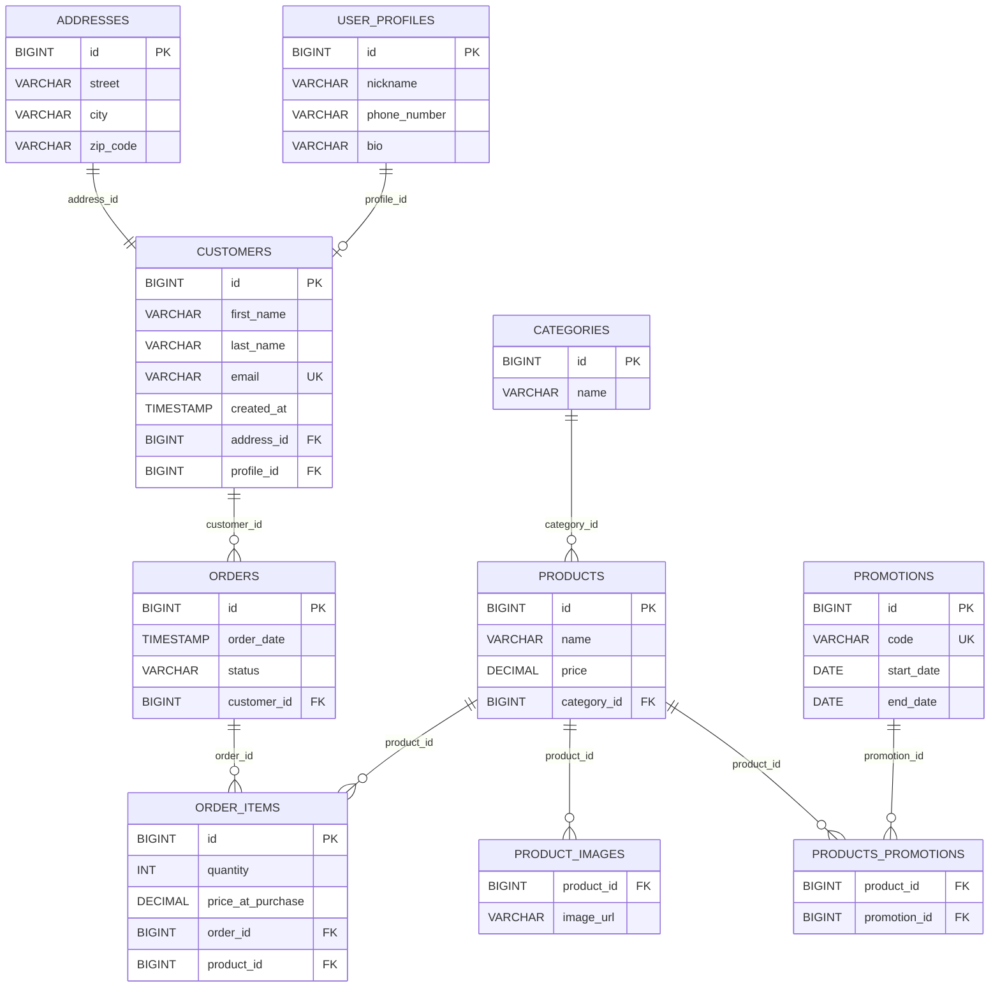
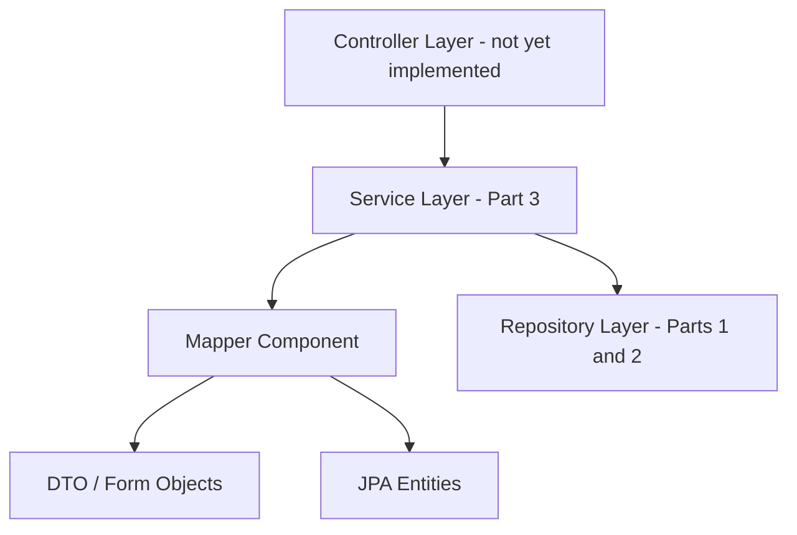



# Lexicon WS eCommerce JPA

Spring Boot e-commerce platform built with JPA. **Part 1** covers One-to-One relationships
(Customer / Address / UserProfile); **Part 2** adds the catalog and ordering system (Category, Product,
Promotion, Order, OrderItem) with One-to-Many and Many-to-Many relationships; **Part 3** adds the
Service Layer, DTOs (Java Records) and Mappers so the presentation layer never touches entities.

## Tech Stack

- Java 17
- Spring Boot 4.1.1
- Spring Data JPA
- Spring Boot Validation (Bean Validation on DTOs)
- H2 (runtime/test) + MySQL (production/development)
- Lombok
- Maven

## Entity-Relationship Diagram (Mermaid)

Full database schema from **Part 1** (One-to-One) and **Part 2** (catalog, orders, many-to-many).

```mermaid
erDiagram
    %% ===== Part 1: One-to-One =====
    ADDRESSES {
        BIGINT id PK
        VARCHAR street
        VARCHAR city
        VARCHAR zip_code
    }

    USER_PROFILES {
        BIGINT id PK
        VARCHAR nickname
        VARCHAR phone_number
        VARCHAR bio
    }

    CUSTOMERS {
        BIGINT id PK
        VARCHAR first_name
        VARCHAR last_name
        VARCHAR email UK
        TIMESTAMP created_at
        BIGINT address_id FK
        BIGINT profile_id FK
    }

    %% ===== Part 2: Catalog & Orders =====
    CATEGORIES {
        BIGINT id PK
        VARCHAR name
    }

    PRODUCTS {
        BIGINT id PK
        VARCHAR name
        DECIMAL price
        BIGINT category_id FK
    }

    PRODUCT_IMAGES {
        BIGINT product_id FK
        VARCHAR image_url
    }

    PROMOTIONS {
        BIGINT id PK
        VARCHAR code UK
        DATE start_date
        DATE end_date
    }

    PRODUCTS_PROMOTIONS {
        BIGINT product_id FK
        BIGINT promotion_id FK
    }

    ORDERS {
        BIGINT id PK
        TIMESTAMP order_date
        VARCHAR status
        BIGINT customer_id FK
    }

    ORDER_ITEMS {
        BIGINT id PK
        INT quantity
        DECIMAL price_at_purchase
        BIGINT order_id FK
        BIGINT product_id FK
    }

    %% One-to-One
    ADDRESSES ||--|| CUSTOMERS : "address_id"
    USER_PROFILES ||--o| CUSTOMERS : "profile_id"

    %% Catalog (1:M / element collection)
    CATEGORIES ||--o{ PRODUCTS : "category_id"
    PRODUCTS ||--o{ PRODUCT_IMAGES : "product_id"

    %% Product Promotion (M:N via join table)
    PRODUCTS ||--o{ PRODUCTS_PROMOTIONS : "product_id"
    PROMOTIONS ||--o{ PRODUCTS_PROMOTIONS : "promotion_id"

    %% Orders (1:M + M:1)
    CUSTOMERS ||--o{ ORDERS : "customer_id"
    ORDERS ||--o{ ORDER_ITEMS : "order_id"
    PRODUCTS ||--o{ ORDER_ITEMS : "product_id"
```

## Project Checklist

### Setup

- [x] Maven `pom.xml` configured with required dependencies
- [x] Git repository initialized
- [x] Workshop files committed
- [x] Application starts without errors
- [x] Pushed to GitHub
- [x] Share with the teacher.
- [x] added resources/application.properties
- [x] added profile properties (application-dev.properties)

### Entities (Part 1)

- [x] Address (table `addresses`, unidirectional, standalone)
- [x] UserProfile (table `user_profiles`, inverse side with `mappedBy`)
- [x] Customer (table `customers`, owner side)
  - [x] Unidirectional One-to-One with Address (`address_id`)
  - [x] Bidirectional One-to-One with UserProfile (`profile_id`, optional)
  - [x] Cascading and orphan removal configured (`CascadeType.ALL` + `orphanRemoval` on Address and profile)

### Repositories (Part 1)

> Backed by Spring Data `JpaRepository` interfaces. Query methods are expressed as **derived queries**
> (method-name spelling) plus a few custom JPQL `@Query` methods where the name cannot express the question.

- [x] CustomerRepository - fully implemented
  - [x] Required: find by email (`findByEmail`), by last name, case-insensitive (`findByLastNameIgnoreCase`),
    by city (`findByAddressCityIgnoreCase`, nested into Address)
  - [x] Optional: email contains keyword (`findByEmailContaining`), created after/between
    (`findByCreatedAtAfter`, `findByCreatedAtBetween`), count by city (`countByAddressCity`),
    exists by email (`existsByEmail`)
- [x] UserProfileRepository - fully implemented
  - [x] Required: find by nickname (`findByNickName`), partial phone number (`findByPhoneNumberContaining`)
  - [x] Optional: bio not null (`findByBioIsNotNull`), nickname prefix (`findByNickNameStartingWith`),
    count by phone prefix (`countByPhoneNumberStartingWith`)
- [x] AddressRepository - fully implemented
  - [x] Required: find by zip code (`findByZipCode`)
  - [x] Optional: find by city (`findByCity`), count customers by zip code (`countCustomersByZipCode`,
    custom JPQL)

### Optional Queries: CustomerRepository

From `SpringBoot-DataJPA-Workshop-Part1.md` (Repository Layer, section 1). The optional queries are five
separate single-purpose methods, each asking one question - an email lookup and a date filter are different
questions, so they are not overloaded onto the same method:

1. **Email contains a keyword**: `findByEmailContaining(String keyword)`
2. **Created after a date**: `findByCreatedAtAfter(Instant date)`
3. **Created between two dates**: `findByCreatedAtBetween(Instant start, Instant end)` (inclusive)
4. **Count customers in a city**: `countByAddressCity(String city)` (returns `Long`, not a list)
5. **Exists by email**: `existsByEmail(String email)` (returns `boolean`)

Derived-query naming rule used throughout: every capital-letter word after the subject is a property on
the entity (nested through referenced entities when needed), and keywords like `IgnoreCase`, `Containing`,
`After`, `Between`, `GreaterThan` are suffixes on the property they modify.

### Verification & Delivery (Part 1)

- [x] Feature branch created (`feature/jpa-part1`) - currently all work is on `main`
- [x] Application runs and schema generated correctly
- [x] Descriptive commits for each major step
- [x] Branch pushed to GitHub with link provided

### Part 2: Catalog & Orders

- [x] Feature branch created (`feature/jpa-part2`)
- [x] Entities & enums (Category, Product, Promotion, Order, OrderItem, OrderStatus)
- [x] Relationships (Many-to-One, One-to-Many, Many-to-Many) with ownership and cascading
- [x] Repositories (Category, Product, Order, Promotion, OrderItem) incl. N+1-safe order-status query
- [x] Descriptive commits for each major step (completed at the Entities, then Repositories milestones)
- [ ] Extra task: data seeding
- [ ] Application runs, schema generated, data seeded
- [x] Branch pushed to GitHub with link provided

### Part 3: Service Layer, DTOs & Mappers

> Source: `SpringBoot-DataJPA-Service-Layer-WorkShop3.md`. Goal is to decouple the persistence layer from the
> presentation layer: controllers (Part 4) will only ever see DTOs, never `@Entity` classes. Packages are named
> as in the assignment: `se.lexicon.ecommerceworkshop.dto` / `.mapper` / `.service`.

#### Architecture

```mermaid
graph TD
    API[Controller Layer - not yet implemented] --> Service[Service Layer - Part 3]
    Service --> Mapper[Mapper Component]
    Service --> Repo[Repository Layer - Parts 1 and 2]
    Mapper --> DTO[DTO / Form Objects]
    Mapper --> Entity[JPA Entities]
```

#### DTOs (Java Records, `...dto`)

Records are immutable and have no setters, so mappers must use the **canonical constructor** when building
them, and entities are populated field-by-field on the way back.

- [ ] `CustomerRequest` - `firstName`, `lastName`, `email`, `password`, `street`, `city`, `zipCode`
  - [ ] Validated with `@NotBlank`, `@Email`, `@Size(min = ...)`
- [ ] `CustomerResponse` - `id`, `fullName`, `email`, `addressResponse`
- [ ] `AddressResponse` - street / city / zip code of the customer
- [ ] `ProductRequest` - `name`, `price`, `categoryId`
- [ ] `ProductResponse` - flattened product including `categoryName` (no nested category object)
- [ ] `CategoryResponse` - `id`, `name`
- [ ] `OrderRequest` - `customerId` + list of items (`productId` + `quantity`)
  - [ ] Validated with `@NotEmpty` on the item list and `@Min(1)` on each quantity
- [ ] `OrderResponse` - order details + status + `List<OrderItemResponse>`
- [ ] `OrderItemResponse` - product id/name, quantity, `priceAtPurchase`

#### Mappers (`...mapper`, Spring `@Component`)

Each mapper owns both directions of the translation so that no other layer has to know the entity shape.

- [ ] `CustomerMapper` - `toResponse(Customer)`, `toEntity(CustomerRequest)`
- [ ] `ProductMapper` - `toResponse(Product)`, `toEntity(ProductRequest)`
- [ ] `OrderMapper` - `toEntity(OrderRequest, Customer, List<Product>)` (builds `Order` + `OrderItem`s) and
      `toResponse(Order)` (includes items, so the `Order.items` collection must be initialized)

#### Services (`...service`, Interface / Implementation)

- [ ] `CustomerService` + `CustomerServiceImpl`
  - [ ] `register(CustomerRequest)` - reject the email if already taken (`existsByEmail`)
  - [ ] `findById(Long)` - return `CustomerResponse` or throw `ResourceNotFoundException`
  - [ ] `update(Long, CustomerRequest)` - update the details
- [ ] `ProductService` + `ProductServiceImpl`
  - [ ] `create(ProductRequest)` - validate that the category exists before saving
  - [ ] `findAll()` - `List<ProductResponse>`
  - [ ] `searchByName(String)` - filtered results (delegates to `findByNameContaining`)
- [ ] `OrderService` + `OrderServiceImpl`
  - [ ] `placeOrder(OrderRequest)` - find customer, find each product, capture the **current** price as
        `priceAtPurchase`, apply active promotions, save order with items
  - [ ] Annotated `@Transactional` so the whole order is all-or-nothing
- [ ] Optional: `CategoryService` - `create(String name)` (duplicate check via `existsByName`), `findAll()`
- [ ] Optional: `PromotionService` - `getActivePromotions()`, `calculateDiscount(Product)`

#### Transactions, exceptions & delivery

- [ ] `@Transactional` on business-critical methods; uncaught runtime exceptions roll the whole
      `placeOrder` back (no half-written orders)
- [ ] Custom exceptions (e.g. `ResourceNotFoundException`, duplicate-email) instead of raw
      `EntityNotFoundException` leaking out of the service
- [ ] `spring-boot-starter-validation` present in `pom.xml` (already the case)
- [ ] Optional: `MapStruct` dependency - manual mappers are the recommended approach
- [ ] Feature branch created (`feature/service-layer`)
- [ ] Descriptive commits for each major step (DTOs, mappers, services, transactions/exceptions)
- [ ] Application runs and all service methods verified
- [ ] Branch pushed to GitHub with link provided

## Workshop

See `SpringBoot-DataJPA-Workshop-Part1.md` for the full assignment details.
See `SpringBoot-DataJPA-Workshop-Part2.md` for Part 2 (catalog management, transactions, many-to-many).
See `SpringBoot-DataJPA-Service-Layer-WorkShop3.md` for Part 3 (service layer, DTOs, mappers).

## Notes

See `Spring-Data-JPA-Annotation-Guide.md` for the annotations guide.
