# Diagram Types & A Full Example App

## 1. Diagram types

### A. UML (Unified Modeling Language) — the classic software diagrams

Split into **structural** (the static shape of a system) and **behavioral** (what happens over time).

#### Structural

| Type | What it shows | Good for |
|---|---|---|
| **Class diagram** | Classes, fields, methods, relationships (inheritance, association, composition) | The OOP design / entities + services |
| **Object diagram** | A snapshot of *instances* at a moment in time | Debugging a specific scenario |
| **Component diagram** | Logical units (controllers, services, DB) and their interfaces/ports | Layered architecture |
| **Deployment diagram** | Physical hardware/nodes and where software runs | Infra, cloud topology |
| **Package diagram** | Groupings of classes into namespaces | Module structure |
| **Composite structure** | Internal parts of one class at runtime | Complex internals |

#### Behavioral

| Type | What it shows | Good for |
|---|---|---|
| **Use case diagram** | Actors + what they can do with the system | Requirements, scope |
| **Sequence diagram** | Messages between objects *over time* (top→bottom) | A single flow end-to-end |
| **Activity diagram** | Flowchart of steps, decisions, parallelism | Business processes, algorithms |
| **State machine diagram** | States of one object + allowed transitions | Lifecycles (Order! Payment!) |
| **Communication diagram** | Sequence without time axis, shows links | Same as sequence, object-centric |
| **Timing diagram** | State of objects across a time axis | Real-time systems |
| **Interaction overview** | A big box of small activity+sequence diagrams | Orchestration of parts |

### B. ERD (Entity-Relationship Diagram) — not UML, but the one you know from JPA

Tables, columns, keys, and cardinality (1:N, N:M). This is what the workshop entities map to.

### C. Mermaid — not a new *kind* of diagram, a **syntax** to write diagrams as text

Mermaid can render many of the above + a few extra project-planning ones.

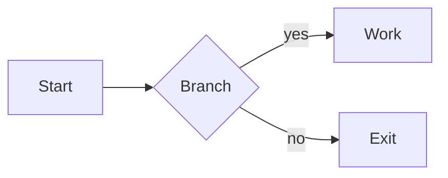

Flowchart — logic, steps, decisions.

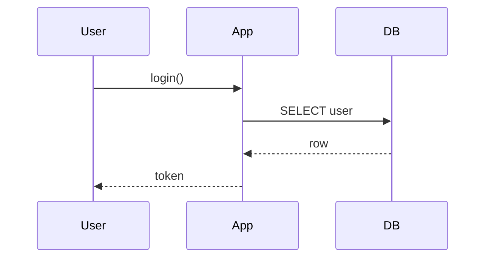

Sequence — the sequence diagram above.

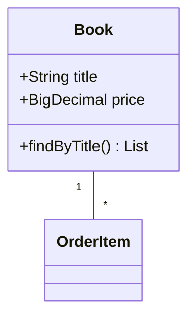

Class diagram.

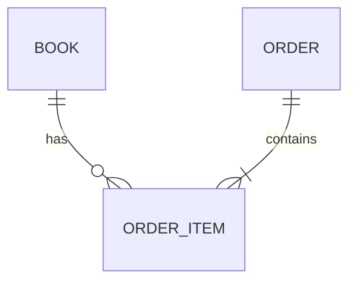

ER diagram.

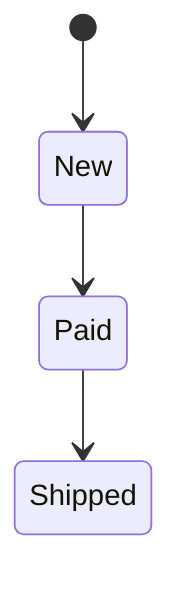

State diagram.

**Mermaid-only extras** (no UML equivalent): `gantt` (sprint plan), `gitGraph` (branch history), `pie` (statistics), `mindmap`, `timeline`, `quadrantChart`, `sankey-beta`, `xychart-beta`, `journey` (UX survey).

---

## 2. A small theoretical app: "Bookstore"

A full-stack webshop: **Angular/plain HTML frontend → Spring Boot REST backend → MySQL**. Customer browses books, places an order (gets confirmation), admin manages inventory.

### Use case diagram (requirements / scope)

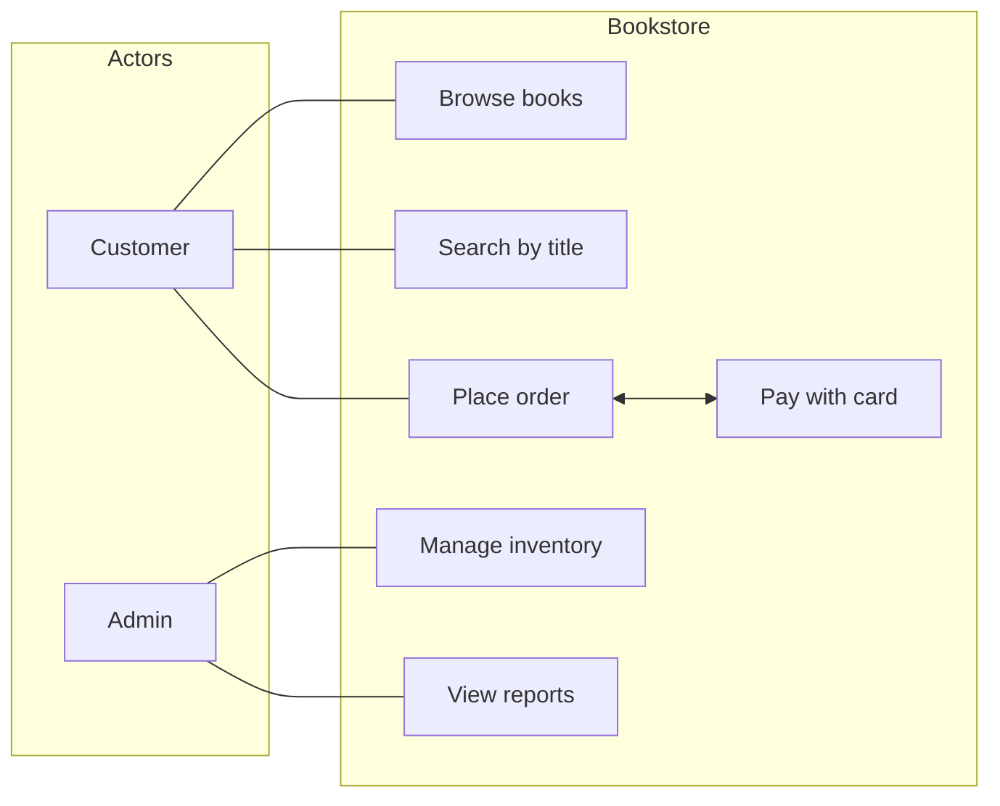

### Class diagram (the JPA entities + layers)

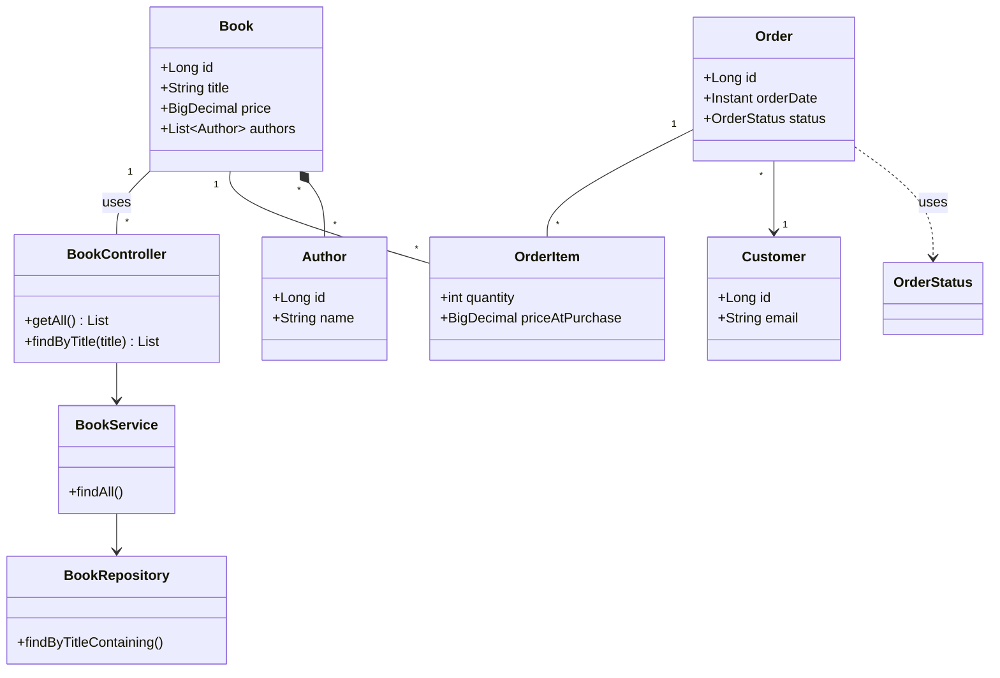

JPA-flavored rules: `OrderItem` copies `priceAtPurchase` (don't read the live price), `Book↔Author` is N:M, `Order` owns its items via cascade.

### ERD (what SQL Workbench actually shows)

```mermaid
erDiagram
  AUTHORS ||--o{ BOOK_AUTHOR : writes
  BOOKS ||--o{ BOOK_AUTHOR : has
  BOOKS ||--o{ ORDER_ITEMS : appears_in
  ORDERS ||--|{ ORDER_ITEMS : contains
  ORDERS }o--|| CUSTOMERS : placed_by

  BOOKS {
    bigint id PK
    varchar(100) title
    decimal(10,2) price
  }
  CUSTOMERS {
    bigint id PK
    varchar(150) email UK
  }
  ORDERS {
    bigint id PK
    datetime order_date
    varchar(10) status
  }
  ORDER_ITEMS {
    bigint id PK
    int quantity
    decimal(10,2) price_at_purchase
  }
```

### Sequence diagram (the core flow: customer places an order)

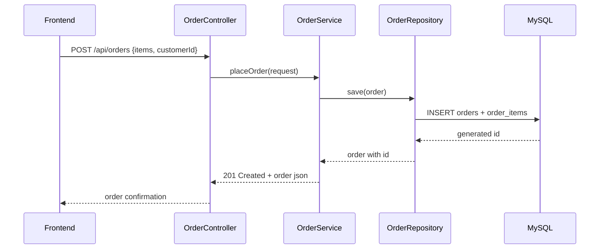

### State machine diagram (Order lifecycle)

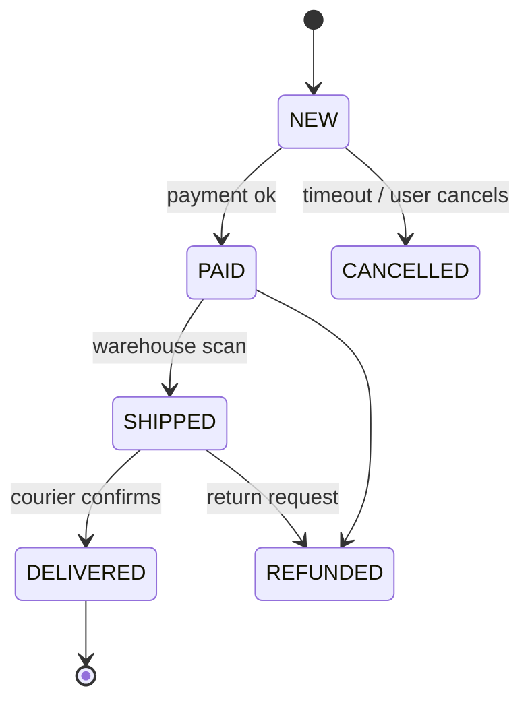

### Activity diagram (order processing as a pipeline)

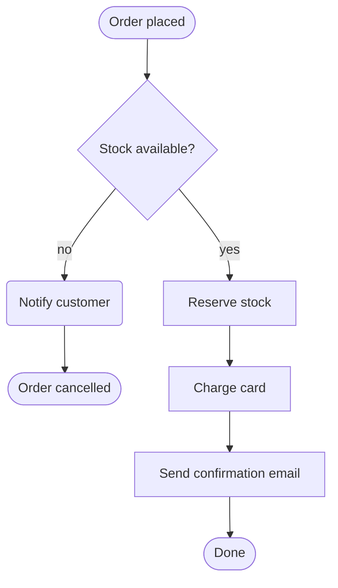

### Deployment diagram (where things physically run)

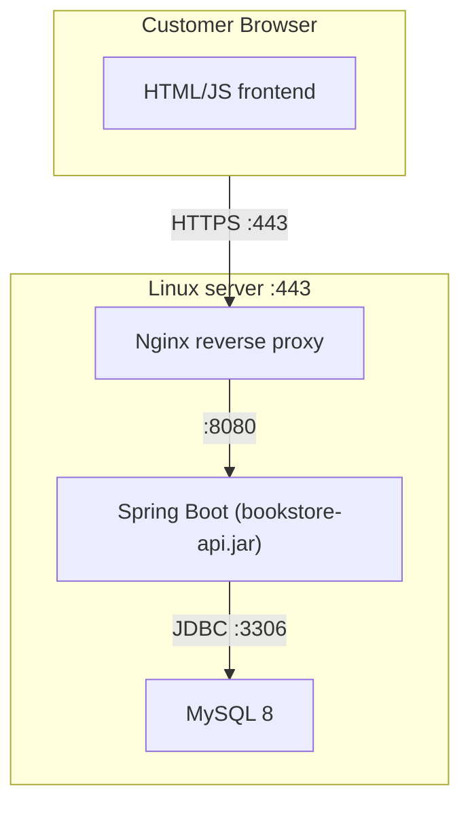

### Gantt (planning the build — Mermaid-native)

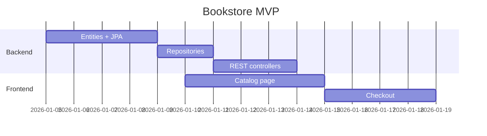

---

## 3. The real project: full UML, Part 1 → Part 3

Diagrams of the **actual** `lexicon-ws-ecommerce-jpa` codebase, not the Bookstore example above.
Read them in order: Part 1 builds the customer, Part 2 bolts the shop onto it, Part 3 wraps both in
a service layer. Mermaid `classDiagram` source is in every fenced block, so you can paste it straight
into a `.md`, GitHub, or the [Mermaid live editor](https://mermaid.live).

Legend: `*--` composition (owns), `o--` aggregation, `<|--` implements/extends, `..>` uses
(dependency), `-->` plain reference. `1` / `0..1` / `0..*` are multiplicities.

### 3.1 Part 1 — Customer, Address, UserProfile

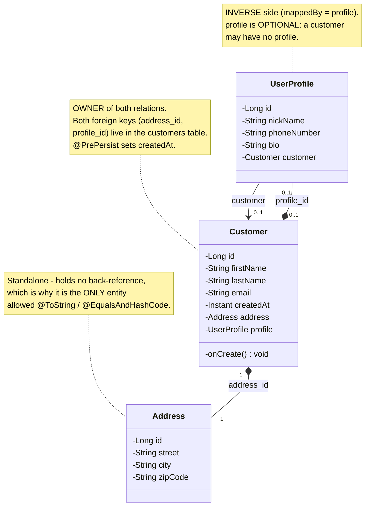

**The two relationships that make this part interesting**

| | `Customer.address` | `Customer.profile` |
|---|---|---|
| Cardinality | one-to-one, **mandatory** | one-to-one, **optional** |
| Owner | `Customer` (`@JoinColumn`) | `Customer` (`@JoinColumn`) |
| Inverse side | none — `Address` is standalone | `UserProfile` (`mappedBy = "profile"`) |
| Cascade | `ALL` + `orphanRemoval` | `ALL` + `orphanRemoval` |
| Bidirectional? | No | Yes |
| Deleting the customer | deletes the address row | deletes the profile row |

### 3.2 Part 1 — Repositories

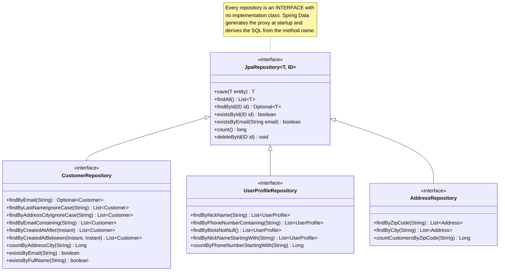

### 3.3 Part 2 — Catalog and orders

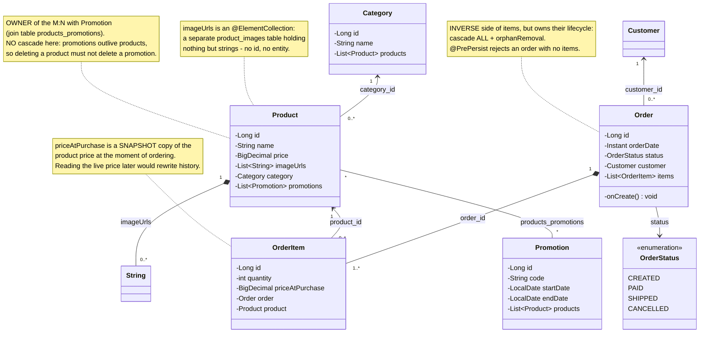

**Ownership and cascade — the table to memorise**

| Relationship | Type | Owner (holds the FK) | Inverse side | Cascade | Fetch |
|---|---|---|---|---|---|
| `Customer` → `Address` | 1:1 | `Customer` | — | `ALL` + orphanRemoval | EAGER (default) |
| `Customer` → `UserProfile` | 1:1 | `Customer` | `UserProfile` | `ALL` + orphanRemoval | EAGER (default) |
| `Category` → `Product` | 1:N | `Product` | `Category` | none | LAZY |
| `Product` → `imageUrls` | element collection | `Product` | — | default | LAZY |
| `Product` ↔ `Promotion` | M:N | `Product` (join table) | `Promotion` | **none, deliberately** | LAZY |
| `Customer` → `Order` | 1:N | `Order` | — | none | LAZY |
| `Order` → `OrderItem` | 1:N | `Order` (inverse, but owns lifecycle) | `Order` `mappedBy` | `ALL` + orphanRemoval | LAZY |
| `OrderItem` → `Product` | N:1 | `OrderItem` | — | none | LAZY |

### 3.4 Part 2 — Repositories

```mermaid
classDiagram
    class JpaRepository~T, ID~ {
        <<interface>>
    }

    class CategoryRepository {
        <<interface>>
        +findByNameIgnoreCase(String) Optional~Category~
        +existsByName(String) boolean
        +findByNameContaining(String) List~Category~
    }

    class ProductRepository {
        <<interface>>
        +findByCategoryNameIgnoreCase(String) List~Product~
        +findByPriceBetween(BigDecimal, BigDecimal) List~Product~
        +findByNameContaining(String) List~Product~
        +findByPriceLessThan(BigDecimal) List~Product~
        +countByCategoryNameIgnoreCase(String) Long
        +findAllByOrderByPriceAsc() List~Product~
        +findAllByOrderByPriceDesc() List~Product~
        +findByCategoryId(Long) List~Product~
    }

    class PromotionRepository {
        <<interface>>
        +findByCode(String) Optional~Promotion~
        +findByStartDateAfter(LocalDate) List~Promotion~
        +findByEndDateBefore(LocalDate) List~Promotion~
        +findByEndDateIsNull() List~Promotion~
        +findActivePromo(LocalDate) List~Promotion~
    }

    class OrderRepository {
        <<interface>>
        +findByCustomerId(Long) List~Order~
        +findByStatus(OrderStatus) List~Order~
        +findByOrderDateAfter(Instant) List~Order~
        +findByOrderDateBetween(Instant, Instant) List~Order~
        +findByProduct(Product) List~Order~
        +countByStatus(OrderStatus) Long
        +findByCustomerIdAndStatus(Long, OrderStatus) List~Order~
    }

    class OrderItemRepository {
        <<interface>>
        +findByOrderId(Long) List~OrderItem~
        +findByProduct(Product) List~OrderItem~
        +findByQuantityGreaterThan(int) List~OrderItem~
    }

    JpaRepository <|-- CategoryRepository
    JpaRepository <|-- ProductRepository
    JpaRepository <|-- PromotionRepository
    JpaRepository <|-- OrderRepository
    JpaRepository <|-- OrderItemRepository

    note for OrderRepository "findByStatus carries @EntityGraph(items)<br/>to load the collection in the same query.<br/>The ONLY query in the project that needs it."
    note for PromotionRepository "findActivePromo needs a @Query:<br/>a method name cannot express<br/>OR + IS NULL."
```

### 3.5 Part 3 — Service layer (DTOs, mappers, services)

This is the diagram the teacher checks. Note that the **controller layer does not exist yet** — Part 4.

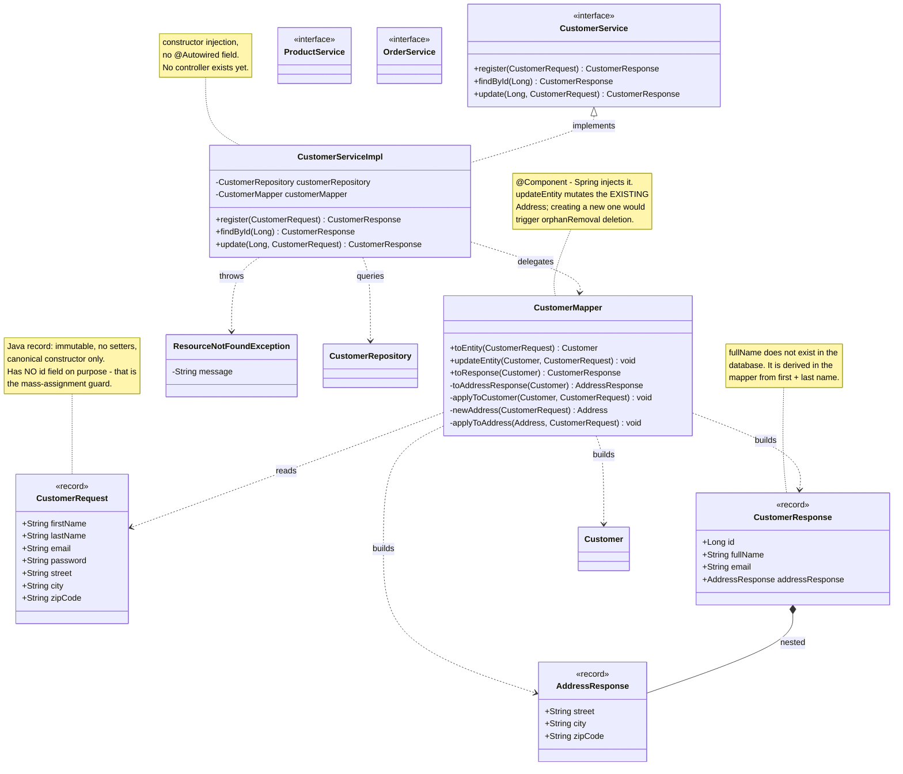

### 3.6 The whole system, all three parts

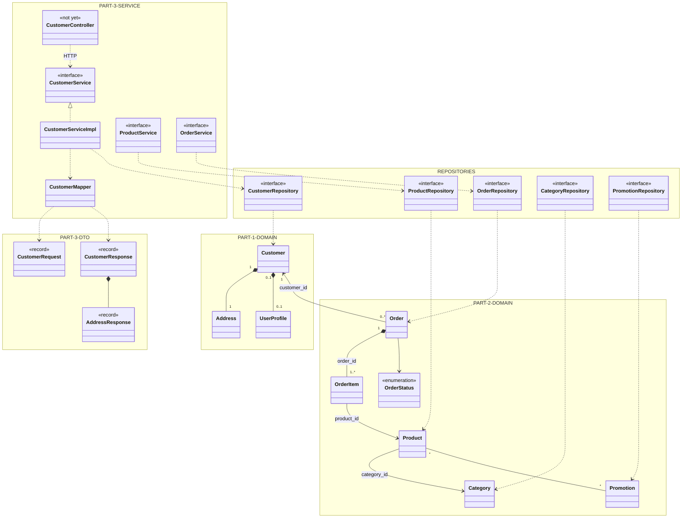

### 3.7 Things the diagrams deliberately do not show

- **Lombok-generated members.** `@Getter`, `@Setter`, `@AllArgsConstructor` and `@NoArgsConstructor`
  give every entity ~30 members. Drawing them makes the diagram unreadable and teaches nothing.
- **`toString` / `equals` / `hashCode`.** Removed from every entity except `Address`, because the
  bidirectional relations (`Customer` ↔ `UserProfile`, `Order` ↔ `OrderItem`, `Product` ↔ `Category`,
  `Product` ↔ `Promotion`) would recurse forever. Equality for a managed entity is its `id`.
- **Collection classes.** `List<OrderItem> items` is drawn as `OrderItem`, not
  `List<OrderItem>`, because the multiplicity (`"1..*"`) already says it is a collection.
- **The `JpaRepository` implementation.** Spring Data generates a proxy at startup; there is no
  `CustomerRepositoryImpl` file to draw.
- **`ResourceNotFoundException` living in `data.exception`.** It should be a top-level
  `exception` package — the diagram shows where it belongs, not where it currently is.